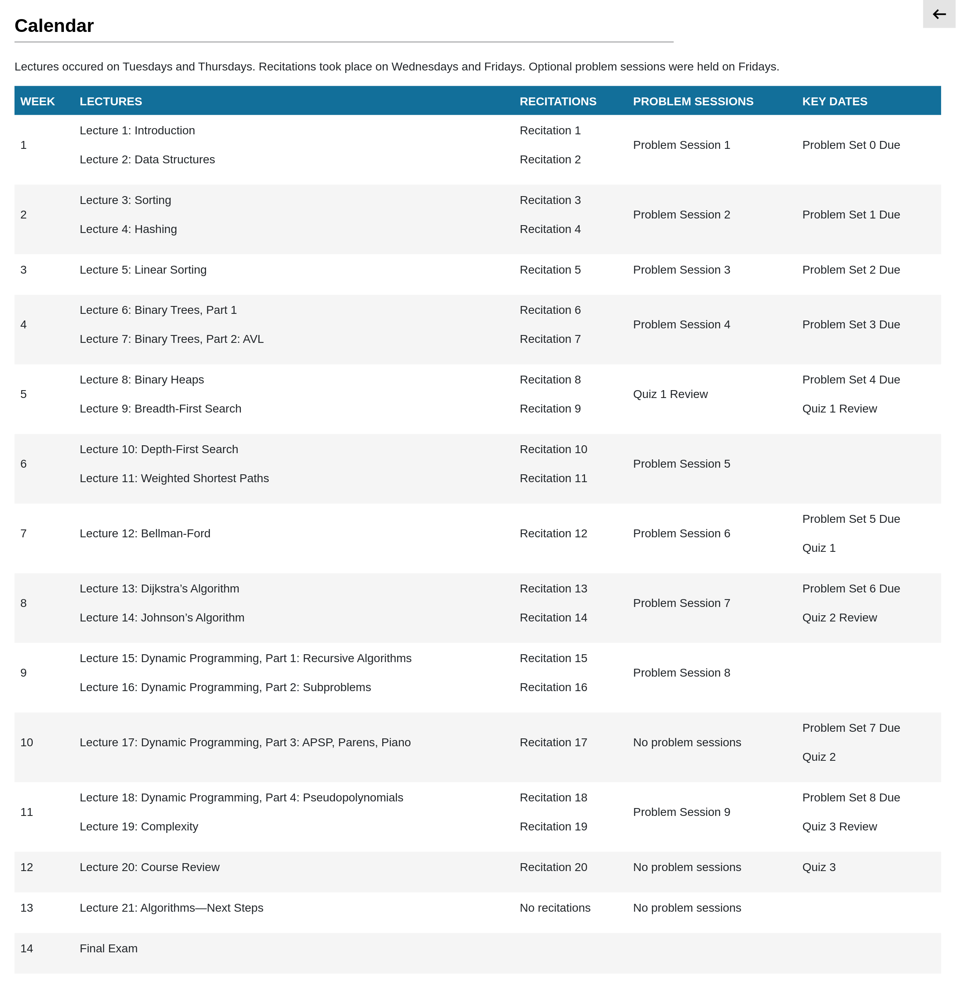

# 6.006: Introductions To Algorithms

[6.006 Introduction To Algorithms](https://ocw.mit.edu/courses/6-006-introduction-to-algorithms-spring-2020)
from the MIT OpenCourseWare.

I opened this repo to give me the social pressure to finish the course.

## Course Description

> This course is an introduction to mathematical modeling of computational
> problems, as well as common algorithms, algorithmic paradigms, and data
> structures used to solve these problems. It emphasizes the relationship
> between algorithms and programming and introduces basic performance measures
> and analysis techniques for these problems.

## Calendar

## Resources

- MIT YouTube Playlists
  - [Recitations (Fall 2011)](https://youtube.com/playlist?list=PLCUgzOB7zhAXwoDTPqyNUeXf2QeW3lV6B).
    I'm using the 2011 recitations since they didn't record the 2020
    recitations, AFAIK.
  - [Lectures and problem sessions](https://youtube.com/playlist?list=PLUl4u3cNGP63EdVPNLG3ToM6LaEUuStEY).

- External recommended resources
  - CS Dojo: <https://www.youtube.com/@CSDojo>
  - Joma Class: <https://www.youtube.com/@JomaClass>
  - <https://github.com/ForrestKnight/open-source-cs>
